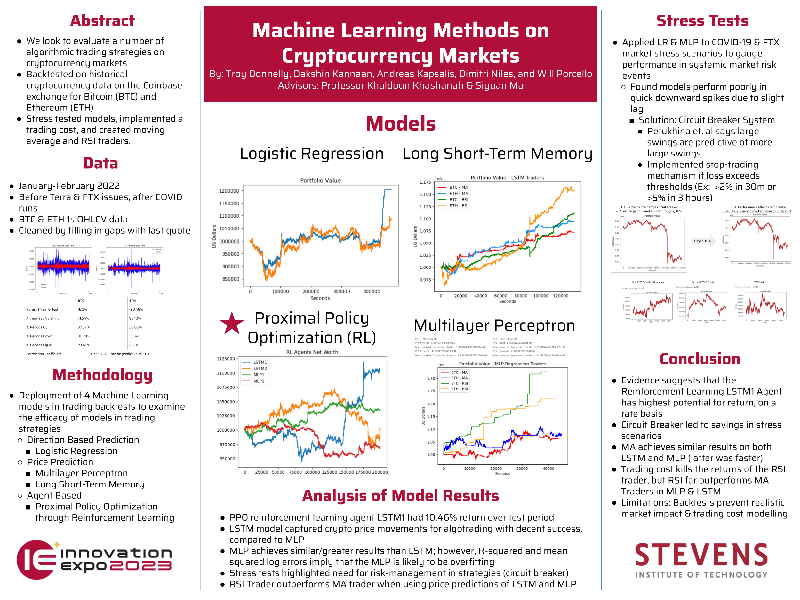

# Deep Learning Algorithmic Crypto Backtesting
### Senior Design Project 2022-2023

<div style="text-align:center;">

</div>

## Introduction

We implement four deep learning models to backtest on millisecond-level cryptocurrency historical CBSE data. This repo contains the code for the Long Short-Term Memory model and Multilayer Perceptron.

Code for the Proximal Policy Optimzation Deep Reinforcement Learning model can be found here: https://github.com/KodeUniverse/Deep-RL-Crypto

WIP: Need to add code for Logistic Regression


## Installation

Clone this repository

```bash
git clone https://github.com/KodeUniverse/senior-design-crypto-trading.git
cd senior-design-crypto-trading
```

## Usage
To use the models, unzip the datafiles located in the <b>market-data</b> folder, and create a folder named <b>data</b> inside the folder of the model you want to use.

Example (for LSTM):

```bash
#change dir into LSTM folder
cd senior-design-crypto-trading/LSTM
#create data folder
mkdir data
```
Extract the contents of <b>market-data</b> and move them into the newly created data folder.

Now you can run the main scripts for each model.


